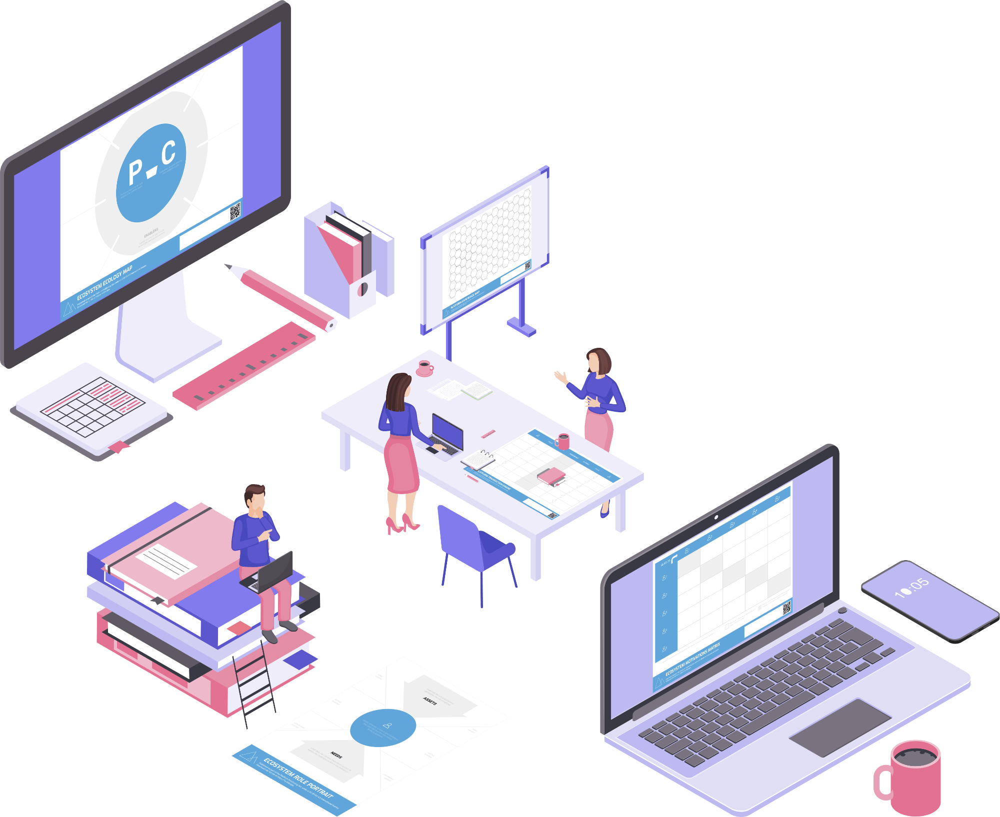

# DiaForm™

DiaForm is a asynchronous workshop format. It provides for untarnished workshop experiences with no need for convening in one physical space. DiaForm is also low touch: empowering self-instruction and self-direction at your own pace.

It's easy enough to start a DiaForm:

* 💾Download [the full set](../../extras/downloads/) of canvases, examples, manual and instruction materials. [Familiarize yourself](../../workshop/checklist.md) on how to put them to the best of use.
* 📺For each step in the design process, watch the provided [instruction video](./#instructions). These videos capture the instruction moments of the high touch workshop.
* 💡Step by step, work on the design of your platform of interest. You'll be using the collaboration tools already at hand in your organisation.
* ☎At [scheduled moments](./#check-ins), check-in online with experienced facilitators for reflection and coaching. These sessions stand in for the high touch facilitation. 

Deferring to your-preferred-collaboration tools and practices is no small matter. There's no longer the hassle of synchronising all participants on a fixed time slot. You're now free to fit with your schedule or mood—spread across days, weeks or months even. 

There's also no more the costs incurred for finding, reserving, and travelling to a suitable workshop location. And who knows, it may appeal to people who would not be that attracted otherwise💁♀ 

## Check-ins

DiaForm provides for scheduling check-ins with seasoned workshop facilitators. This is wholly optional and without them you will get to a valuable design outcome regardless. A check-in does inject a moment of reflection and coaching, and of taking stock of the trees _and_ the forest.

Check-ins will follow your pace along the design process. One for each design layer completed is a common schedule. Condensing it to a check-ins at [Experience](../../position/experience.md) and [Challenge](../../position/challenge.md) layers is viable too.

Interested? [Schedule a call](https://doodle.com/mm/ronkersic/book-a-diaform)📞to discuss facilitation for your DiaForm.

## Instructions

Instruction videos, along with their transcripts, guide you over the full [five layers of platform design](../../). You can watch these in order of the [public playlist](https://www.youtube.com/playlist?list=PLekE2jzg2wqfDlaqxdPFySpmj3oogVTWb), or pick out individual ones from the list below:

