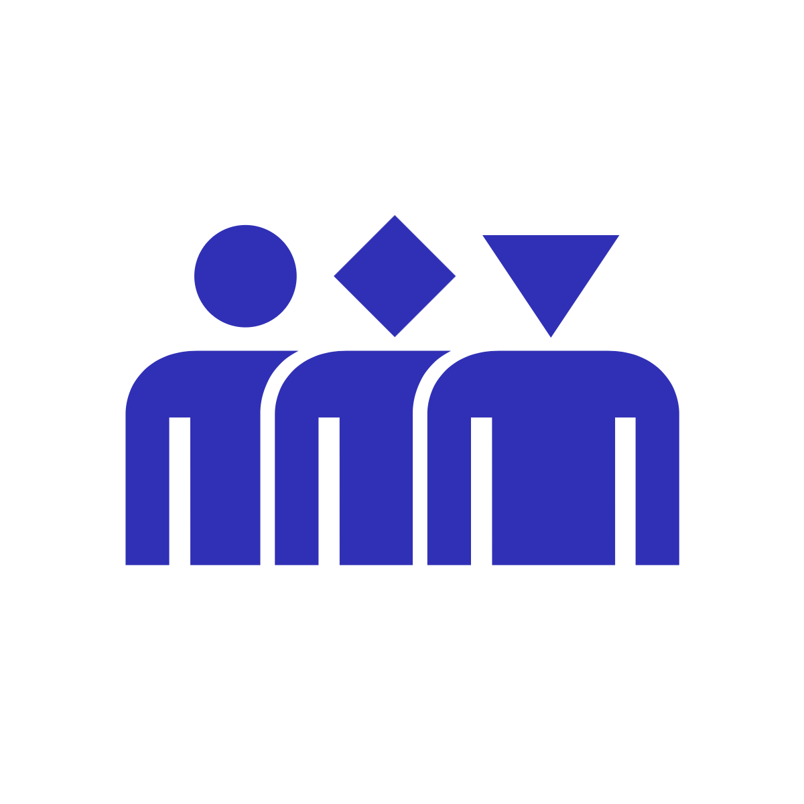

# VucaCanvas®

## For your toolbox

[VucaCanvas®](https://www.vucacanvas.com/) is a framework to shockproof organisations and communities, and prepare them for unpredictable and hyper-connected futures. The framework supports a set of canvasses and an interactive \(virtual\) workshop. Apply these to tweak your platform's design and have it respond well to shocks.

## Stress the platform

VucaCanvas® introduces the concept of stressors:. capacities that are helpful in coping with [Volatile, Uncertain, Complex and Ambiguous](https://en.wikipedia.org/wiki/Volatility%2C_uncertainty%2C_complexity_and_ambiguity) environments. Stressors derive from evolutionary biology and describe how complex social systems behave, develop and survive. Stressors are a present from nature🎁

Each stressor shapes a specific capacity to shockproof and vibrant social systems:

* \*\*\*\* **Adaptive** - capacity to adjust
* \*\*\*\* **Sensitive** - capacity to be receptive
* \*\*\*\* **Resilient** - capacity to rebalance
* \*\*\*\* **Connective** - capacity to interlink
* \*\*\*\* **Divers** - capacity to vary
* \*\*\*\* **Cooperative** - capacity to collaborate

Injecting stressors into a platform's design will show up how it tends to respond to surprises and shocks. This is performed in three steps: form landscapes👉get insights👉find interventions. 

* \*\*\*\*🌳**Form landscapes**: the platform team stresses their design by assessing the six capacities. To assess, the elements of each capacity get scored on a sliding scale:

* \*\*\*\*🔭**Get insights**: the team reflects on the landscape thus formed. These observations unfold insights about the level of development of each of the capacities:  

  > Most capacities are well developed. The _Sensitive_ capacity shows that ecosystem as a whole is not all that receptive to surprises: a single news article could have a severe impact on AirBnB's identity and image. The _Connective_ capacity uncovers that there are little to no mechanisms to shift negative sentiments. There is a seeming lack of a just cause and the network seems to benefit from financial benefits mainly.l

* \*\*\*\*⚡**Find interventions**: the teams gathers the insights to have a top 3 of interventions emerge. Each interventions is aimed at changing patterns in the ecosystem and bringing the platform to a next level.   

  > 1. Design and enable ‘deep learning’ within the platform to better understand collective patterns and behavior. 
  > 2. Reshape the network around a ‘just-cause’ f.i. create a sustainable network which is not threatening the cohesion in neighborhoods. 
  > 3. Reinforce and communicate a set of values for the network to guide hosts and guests in their connections and travels \(example: Patagonia\).

## Start organising

A workshop can be facilitated on-location \(4-50 people\). An inspiring event using canvasses, Duplo bricks and conversation to stress the social platform and discover insights and interventions. Alternatively, a workshop can be facilitated on-line \(4-10.000 people\) using an interactive learning platform with sense-making and meaning-making software. 

There is the possibility to hold your own workshops by joining an \(online\) accreditation training.  
Find more information on [www.vucacanvas.com](www.vucacanvas.com)

