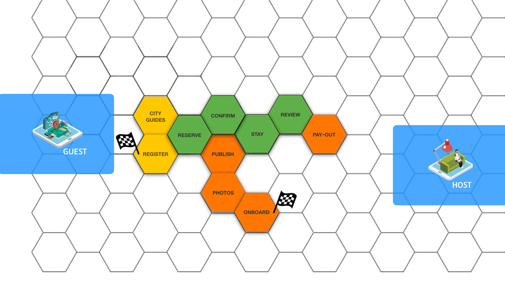
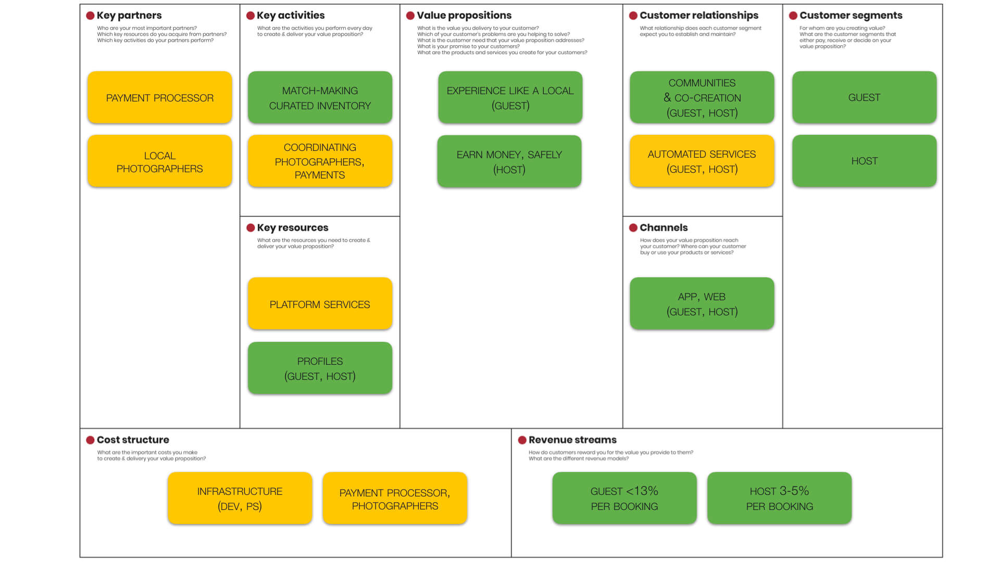

# Challenge

The tools and rules developed for the [innovation engine](tools.md) are the only parts over which the platform has truly creative control. Move up the platform layers and more of that control shifts to the platform participants. In this context of emergence, it is critical to keep the number of platform features to a minimum. Every extra feature will have a compounded—and at times serendipitous—impact on the platform experiences. 

This [Minimum Viable Platform](../extras/glossary.md#mvp) builds from the essential elements of each of the platform engines. The [Platform Experience Map](../workshop/canvases.md#platform-experience-map) is a simple yet effective tool for composing the MVP from these elements:

* Place the essential [touchpoints](../extras/glossary.md#touchpoint) from the [transaction engine](interaction.md) on the canvas, side by side.
* Around each touchpoint, add the [innovation engine](tools.md) services roles _need_ for participating:

Take care for the MVP to cover a [repeatable and scalable](https://medium.com/@sarahtavel/the-hierarchy-of-engagement-expanded-648329d60804) value exchange. Repeating exchanges include _compensation_ next to base creation and consumption; [_curation_ and _customisation_](https://platformthinkinglabs.com/scaling-strategy-platforms/) ensure desirability of the exchanges with increasing participation:  

Composed and cross-checked like this, the MVP will represent a [feasible, viable, and desirable](https://www.interaction-design.org/literature/article/from-prototype-to-product-ensuring-your-solution-is-feasible-and-viable) business model. The [Business Model Canvas](https://www.strategyzer.com/canvas/business-model-canvas) is a great tool to capture, share and discuss this business model. With this, let's [organise](https://organise.futuring-architectures.com/) for the platform to see the light...👊 

