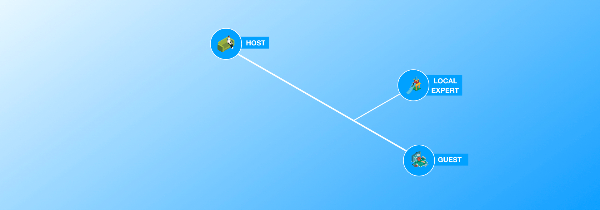

# Experience

A platform provides an interface _among ecosystem roles_ rather than one _between selected parties_. This interface enables connections and collaborations, instead of delivering prescribed outcomes. That job of generating outcomes shifts to the roles in the ecosystem leveraging the platform interface.

> You know you have a platform when the users can shape their own experience—not just accept the maker’s ideas –Jeff Jarvis, quoted in [Platform Scale](https://www.amazon.com/Platform-Scale-emerging-business-investment-ebook/dp/B015FAOKJ6).

Successful platforms engage a wide range of roles to connect and collaborate in a variety of ways towards many different outcomes. Still, they all evolved from a single initial core: the series of experiences so convenient, accessible and valuable that it pulls key roles onto the platform.

The fundamental purpose of your platform is make these core experiences happen. Over time, you'll add other experiences designed to attract new roles, help existing roles meet new goals, or help them create new forms of value. For now, let's design those core experiences...👉

## Key relationship

The core experiences will likely not attract all roles in equal strength. Likewise, not all roles will engage in those experiences with the same vigour. 

Try and pick two or three roles without which the platform _for sure_ would be a barren place. As a rule of thumb: these roles tend to be closest to the [Keystone](frame/roles.md#keystone), and should include at least one [Producer](../extras/glossary.md#producer) and one [Consumer](../extras/glossary.md#consumer). It's easy enough to iterate on your choice at any point, so pick what feels right:

## Experiences

A role engages in the key relationship to achieve new aspirational goals or meet existing objectives better \(by some measure or another\). The [Ecosystem Role Portrait](../workshop/canvases.md#ecosystem-role-portrait) helps in illustrating this by outlining experiences that unlock a role's potential. You design these experiences to meet or exceed a role's needs, and these needs in turn emerge from the role's story and assets:

* **Story** - the traits, events, behaviour and challenges that define how the roles relates to ecosystem.
* **Assets** - the resources acquired and the capabilities developed for the role to leverage on its story.
* **Needs** - the assets lacking or missing in overcoming the challenges told in the story. It's these needs that the role seeks from the ecosystem. 

The [Motivation Matrix](frame/motivations.md) provides quite a bit of help here. The role's intrinsic motivation outlines the story \(and could stand in for the story if need be\). The assets will show through in any of the role's gives-to connections. 

Coming up with a experience could be as easy as rephrasing a need as a statement: _'I pay a fair price'_. In general, you may want to craft experiences that address one of the following [positional scarcities](https://alexdanco.com/2019/09/07/positional-scarcity/):

* **Access** - help the role reach whoever it needs in the ecosystem
* **Curation** - help finding what the role specifically likes
* **Prestige** - help differentiating the role and wielding status 

## Pull

Across their experiences, the roles combine their assets in a systematic way for mutual access and benefit. To verify you have picked a relationship with this combining and benefiting going on, line up the individual role portraits:

Look for the presence of feedback loops: a roles's activity enables another role's solution, whose activity in turn enables the former's solution. Another loop is a role's solution improving with increased use and thus encouraging ever more usage . It's these loops that pull roles together in a relationship, and on your platform.

Line up the portraits of your selected roles, left to right, and shuffle them around until the core experience reveals itself💡If no pull emerges, pick another role and [adjust the relationship](experience.md#key-relationship) accordingly.

