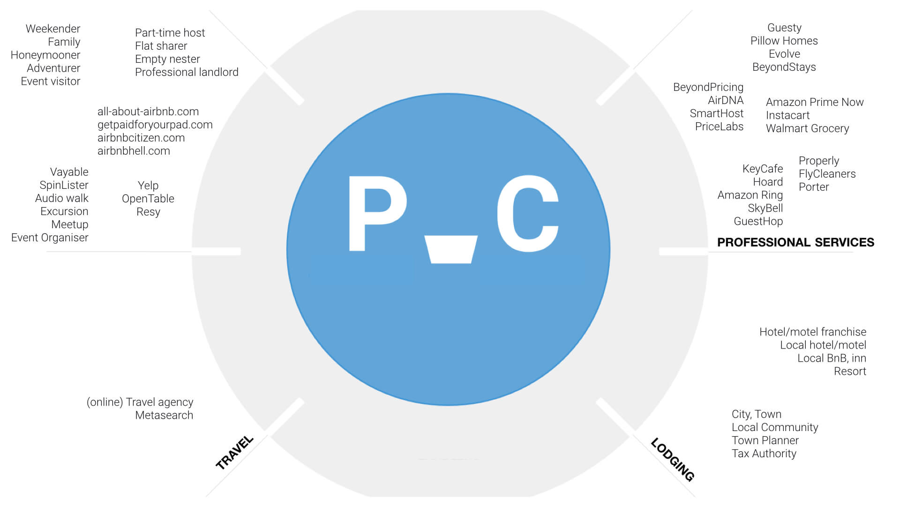

# 👨‍👨‍👧‍👦 Entities

You will start seeing the ecosystem once you look beyond suppliers, distributors and wholesalers—beyond direct contribution to the creation and delivery of a product, service, or experience.

There will be parties that in some way provide a means for your business to function in the first place: financing, foundational technologies, or complementary products. There are competitors and customers with actions and responses that make best laid plans go astray. Regulatory agencies and media outlets can have the same kind of influence—indirect perhaps but not less impactful.

Uncovering the ecosystem in this way is very much a quantitative exercise: get a sheet of paper and write down _any_ name that springs to mind, and keep writing. More _is_ better and there is _always_ more: the suppliers and partners behind your providers, the customer tiers served by your customers, and so on.

The [Ecosystem Ecology Map](../../workshop/canvases.md#ecology-map) can help in structuring this process of discovery. With this map, you uncover and then explore domains, sectors, or segments one by one. The AirBnB ecosystem, for example, points to a few of these worth exploring in some detail:

