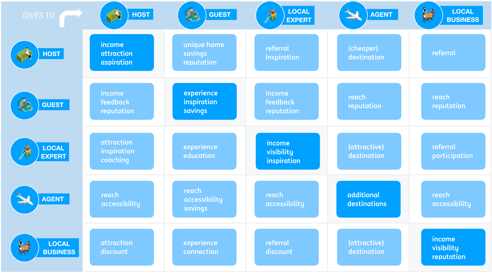

# 🏁 Motivations

The [Ecosystem Motivation Matrix](../../workshop/canvases.md#ecosystem-motivations-matrix) helps in understanding the connections between the [key roles](roles.md#key-roles) in the ecosystem. It also brings to the fore the interests of each such role and what their expectation is from their involvement.

The first step is to analyse one by one the connections: organise the key roles on the Matrix and assess what each of these roles could—potentially—give to any of the others. Think not only of the exchange of money, goods and services, but also of ideas, feedback, and validation:

If a role shows little to no potential for connecting with the other roles, it most likely is not very influential after all. Best to identify [an alternative key role](roles.md#key-roles) instead, using the Matrix for context. 

If a role shows little to no potential for connections from the other roles, it may not be very motivated to get involved. The second step is to investigate the motivation behind the roles' actions: note for each role what drives their involvement. Think not only of financial or material rewards, but also of needs for [achievement, power and affiliation](https://www.managementstudyhq.com/mcclellands-theory-of-needs-power-achievement-and-affiliation.html):

