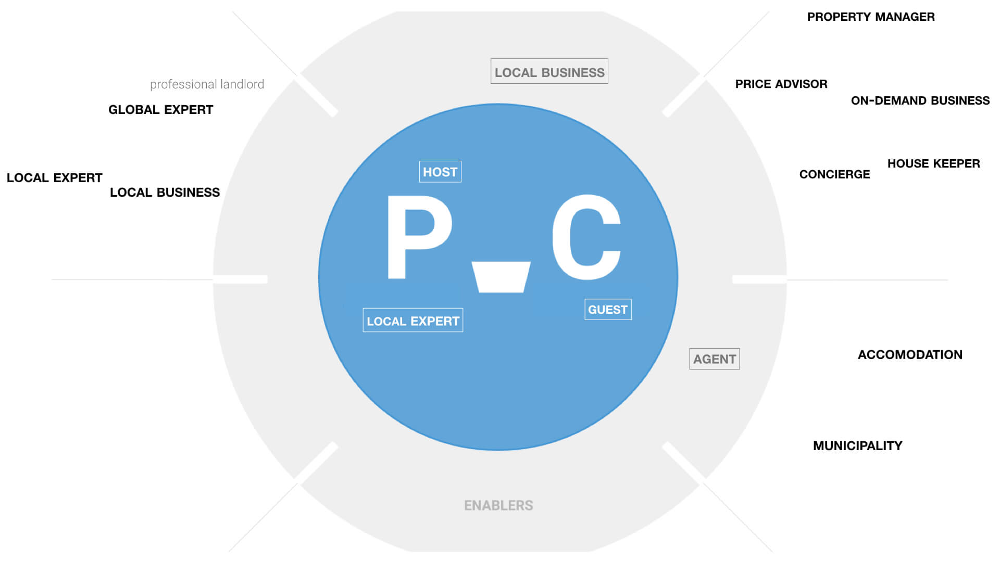

# 🎭 Roles

You will most likely find the ecosystem to host dozens, if not hundreds, of entities. To see the forest for the trees, it is helpful to structure the entities into roles. 

A [role](../../extras/glossary.md#ecosystem-role) represents a group of entities that relate in some way or another: by having comparable assets to leverage, seeking for similar outcomes, or representing a market segment. An entity can play in more than one role at any one time, and an ecosystem may share roles with other ecosystems.

As roles abstract from actual entities, name them in somewhat relative and generic terms. You'll find it more easy to scale out to as yet undiscovered entities later on. Modelling roles after jobs—even from seemingly unrelated domains—seems to work well:

## Key roles

The ecosystem is a heterogeneous structure. Different entities assume different roles that affect different aspects of the ecosystem. Some roles are more influential than others: their prosperity is a direct predictor of stability, productivity and creativity in the entire ecosystem. 

There are few distinct positions from which a role can bring its influence to bear:

* As a [Consumer](../../extras/glossary.md#consumer), representing demand and utilizing available supply.
* As a [Producer](../../extras/glossary.md#producer), responding to demand and contributing to available supply.
* As an [Enabler](../../extras/glossary.md#enabler), supporting exchange of supply through technologies, products and services.

Decide on the most influential roles and their interdependencies in your ecosystem. Understanding these will be your way to understanding health and dynamics of the full network. For this to be a true focus, limit yourself to picking no more than five of these key roles: 

## Keystone

Roles are design constructs and as such they will be observable in the current day ecosystem by varying degrees. More often than not, a role needs some form of support to start fulfilling on the potential envisioned.

The [Keystone](../../extras/glossary.md#keystone) role provides this support to the ecosystem. Its purpose is to simplify the complex tasks of connecting entities and distributing value accrued among them. The Keystone’s importance to ecosystem health is such that its removal can lead to collapse of the entire system.

The Keystone also represents the pull of the ecosystem: it captures why and how the ecosystem will attract and retain entities in significant numbers. It's because of this pull that the idea of [turning a loft into a bed and breakfast](https://www.businessinsider.com/how-airbnb-was-founded-a-visual-history-2016-2) turned out to be something bigger than a stopgap for rent:

