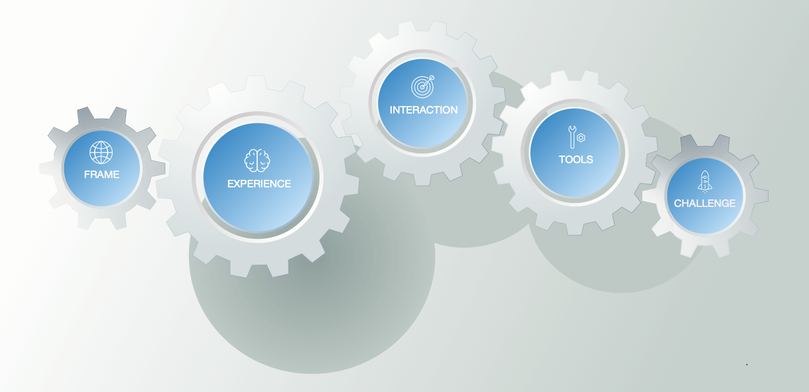

# From Frame to Challenge

You will get to understand and then describe your platform in five distinct layers. The three centre layers hail from the excellent [TRIE framework](http://platformed.info/the-trie-framework-platforms/). Moving left-to-right across this trio expresses how [participants](../extras/glossary.md#platform-participant) will learn the platform; the reverse direction describes how the platform will be built, tested, and managed: 


**Tip:** Reading up on [TRIE](http://platformed.info/the-trie-framework-platforms/) makes for an excellent😘introduction to building platforms.


This manual adds the two outer layers to capture the outside-in and inside-out design perspectives, making it a true end-to-end process.

There is no prescribed order to traversing the layers—as long as you make sure to visit and align each layer. For a first time exercise, best stick to the same learning path as the platform's participants: from left to right, from [Frame](frame/) to Challenge...👉 

