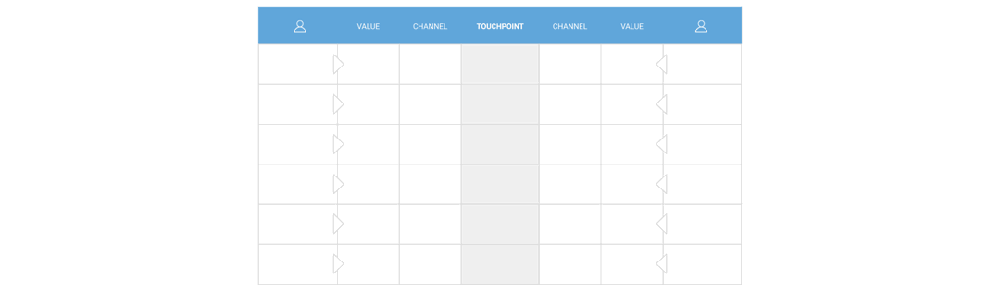

# Tools

The platform facilitates, guides and governs its [interactions](interaction.md) in delivering the core [experiences](experience.md). Platform tools and services enable and encourage desired actions; platform rules and constraints discourage and disable unwanted actions.

Tools and rules are means for participants to not only come into their roles but also to redefine them. To not only _start out_ in a first series of interactions but also to _stand out_ among peers over time and be the role's [rising tide](https://en.wikipedia.org/wiki/A_rising_tide_lifts_all_boats). 

The [Platform Innovation Engine](../workshop/canvases.md#platform-innovation-engine) describes the tools and rules developed for a given role as complements to the role's touchpoints:

Not all roles need dedicated means for all their touchpoints and across both stages of maturity. Still, a healthy number of tools and services for roles—producers specifically—to stand out is a sure sign of the platform's viability over a longer period of time. 

