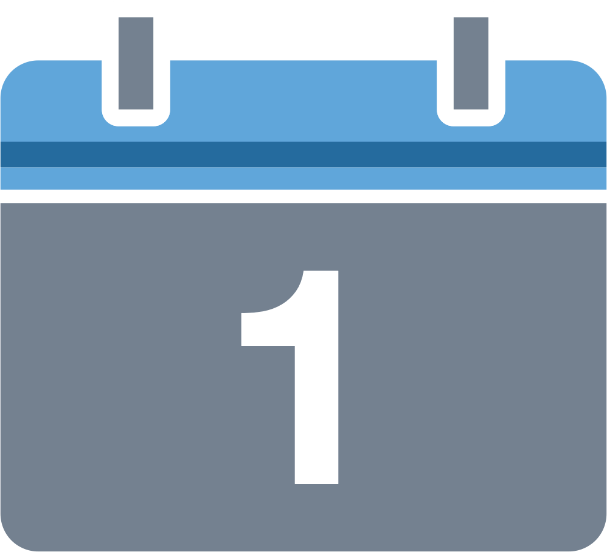
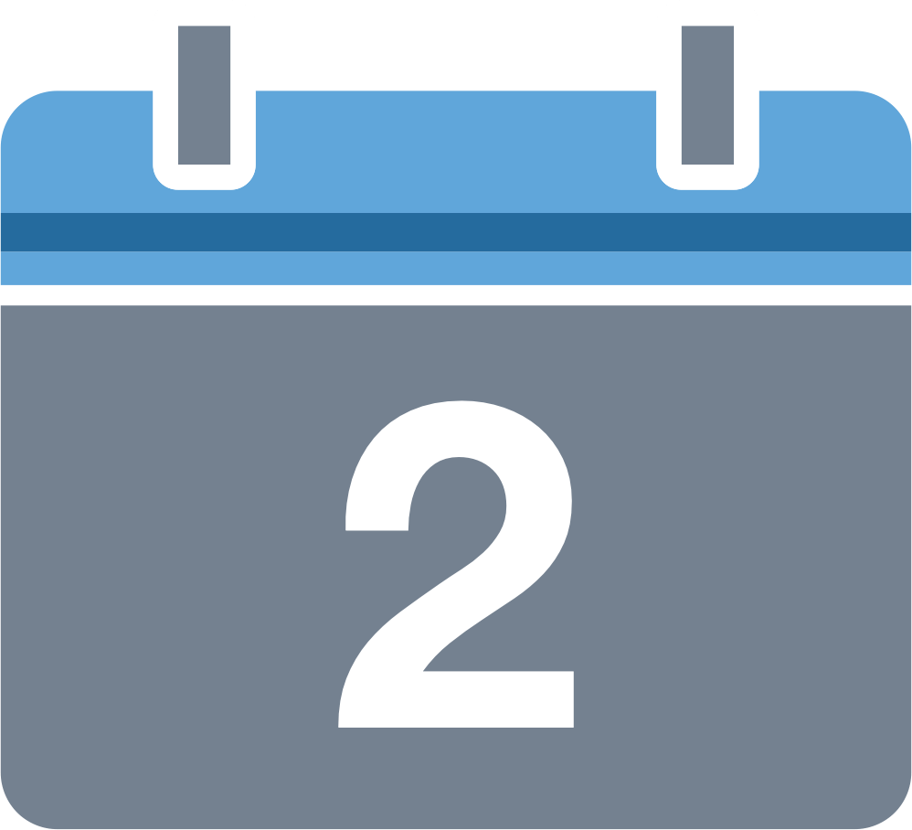
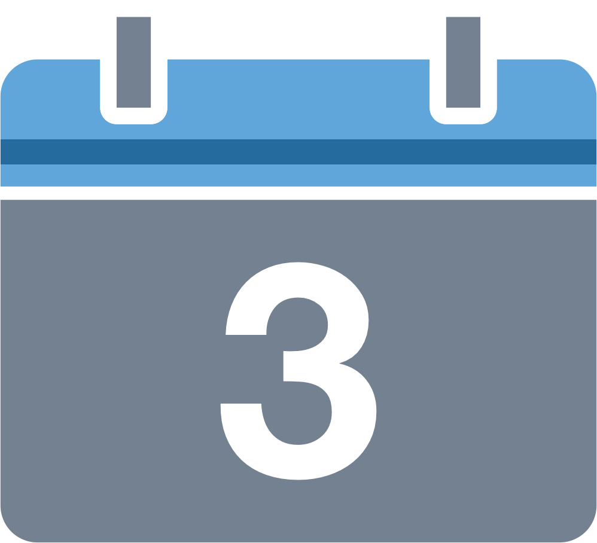
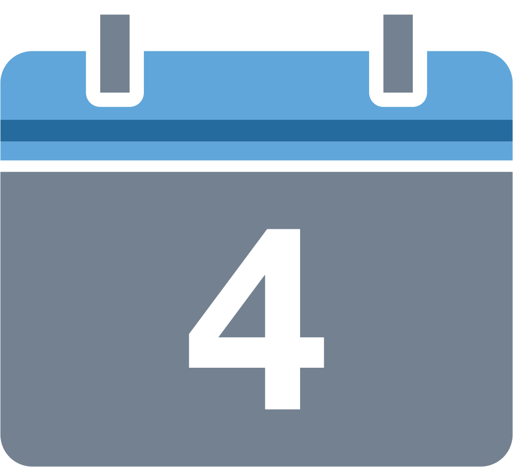

# Format

A high touch workshop format complements this manual. It provides collocated collaborative design experiences for small to medium size audiences.

The workshop covers four distinct parts and spans the better part of two consecutive days. Participants work in groups on platform opportunities of their choice, layer by layer:

* \*\*\*\* Introduction to platforms and [platform design](../extras/glossary.md#platform-design)
* \*\*\*\* [Frame](../position/frame/) the ecosystem
* \*\*\*\* Platform [Experience](../position/experience.md) and [Interaction](../position/interaction.md)
* \*\*\*\* Platform [Tools](../position/tools.md) and [Challenge](../position/challenge.md)

Budget at least one hour for the introduction part, and three hours for each of the subsequent parts.


Organising a fair amount of people around a fixed two-day time slot can be a hassle. Resist the temptation to shorten or even skip parts, or spread them over a period of time. Build up some experience first on what works for you, and your organisation and audiences.


## Facilitation

The workshop needs a facilitator who keeps the process moving and the participants focused. There is no  need for the facilitator to be a platform expert: this manual and the [downloadable](../extras/downloads/) workshop instructions see to that. 

The [online instruction videos](../bonus/diaform/#instructions) can stand in for the facilitator delivering the instructions. There's is no difference whatsoever in the content addressed nor in the flow of delivery.

## Audiences

The workshop works well for a broad range of audiences. It requires no upfront expertise on \(or much interest in\) platforms and innovation—a willingness to put in some elbow grease is all.

In general, you may find use for the workshop in the following contexts:

* ⚗The lab: to educate on the intricacies of platform design.
* 🛠The garage: to develop a minimum viable platform proposition.

